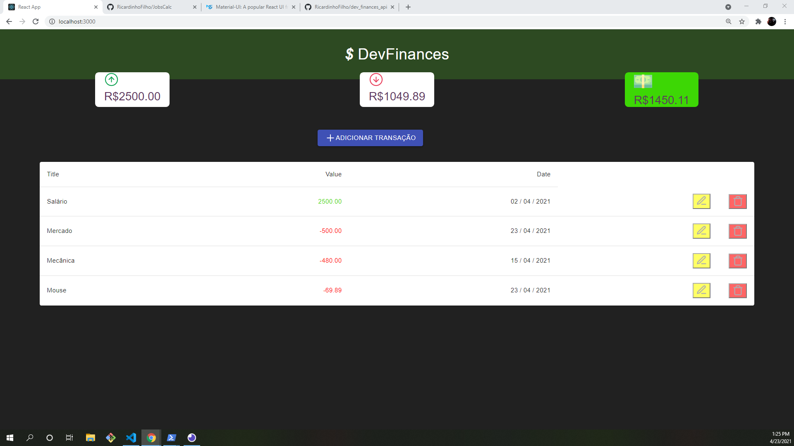
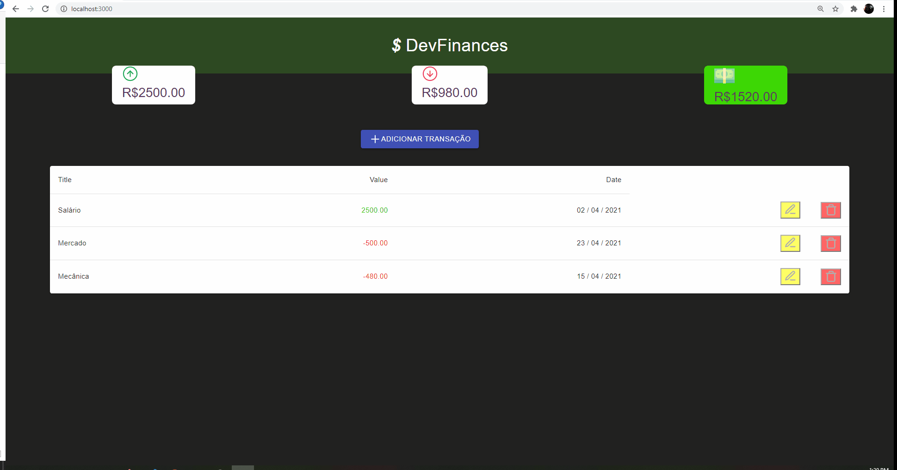

<h1 style="text-align: center;"> DevFinances React-App </h1>
  
<h2>🚀 Technologies</h2>

<ul>
    <li>HTML</li>
    <li>CSS<ul>
    <li>
        Material-UI
    </li></ul>
    </li>
    <li>JavaScript</li>
    <li>ReactJs</li>
    <li>Axios</li>
</ul>

<h2>💻 Project</h2>

DevFinances is an application intended to facilitate the management of personal finance. This project is inspired by  <a href="https://github.com/RicardinhoFilho/Maratona-Discover">Maratona Discover #1</a>, where we stored our transactions in LocalStorage, but in this version, DevFinances React-App consume parts of <a href="https://github.com/RicardinhoFilho/dev_finances_api">DevFinancesApi</a> to create, update, delete and get transactions!

<h2>📝 How to Use</h2>
First, you need get <a href="https://nodejs.org/en/">node</a> on your computer. After you need get <a href="https://github.com/RicardinhoFilho/dev_finances_api">DevFinancesApi</a>, the step by step you can read in <a href="https://github.com/RicardinhoFilho/dev_finances_api">DevFinancesApi's</a> readme!
Then run de commands below in your terminal!  
<ol>
<li>Run <code>git clone https://github.com/RicardinhoFilho/DevFinances-ReactApp </code></li>
<li>Run <code>npm i</code></li>
<li>Run <code>npm start</code></li>
</ol>

